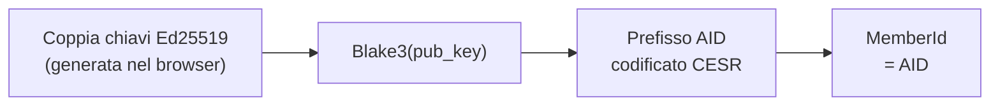
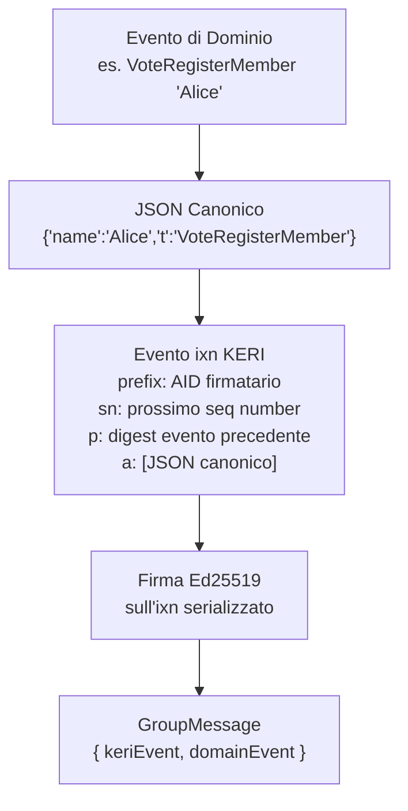
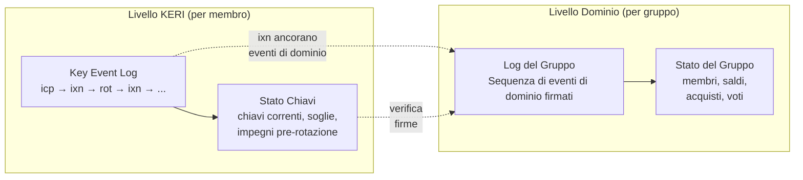
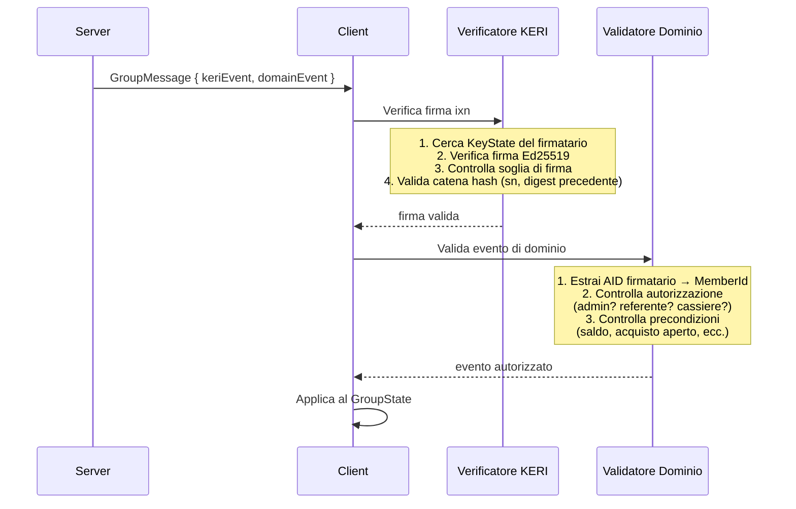
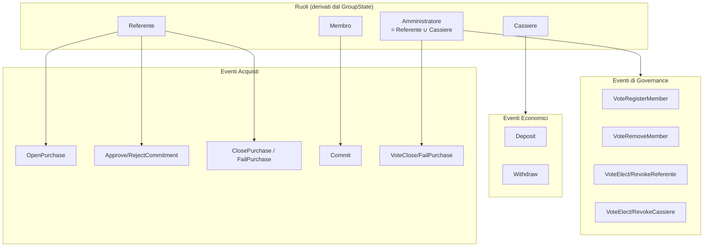
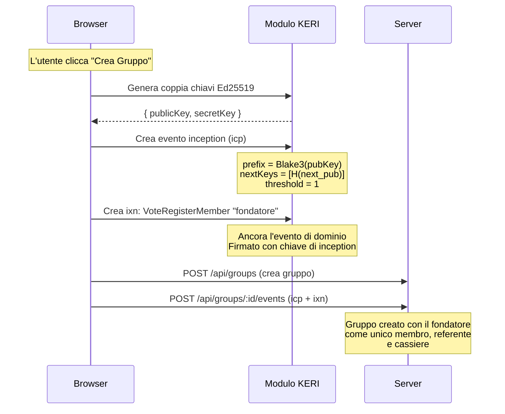
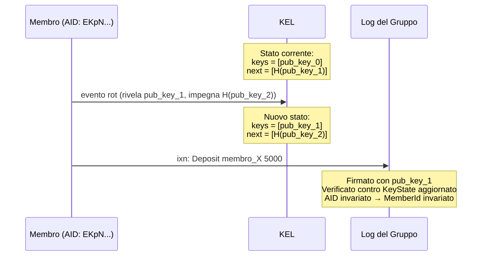
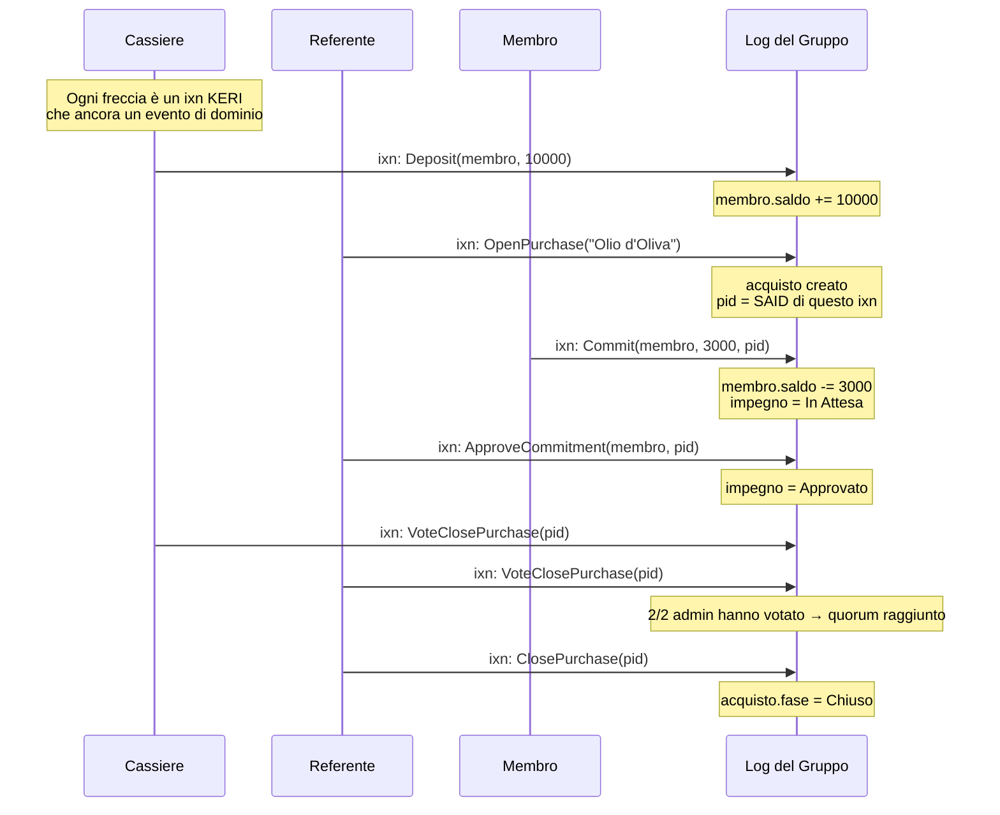
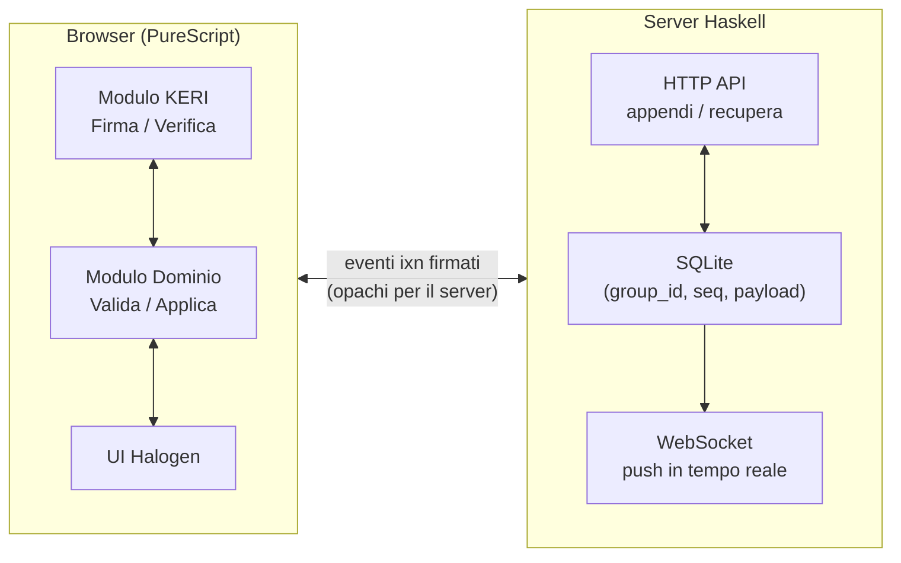

# Integrazione KERI

Come keri-coop mappa il dominio degli acquisti cooperativi sulle primitive KERI.

---

## Identità = KERI AID

Ogni membro è identificato dal proprio **Autonomic Identifier** (AID),
derivato dalla chiave pubblica Ed25519 tramite hashing Blake3 e codifica
CESR. Non c'è username/password — l'AID *è* l'identità.



Il tipo `MemberId` è un newtype su `AID`:

```purescript
newtype AID = AID String        -- prefisso codificato CESR
newtype MemberId = MemberId AID -- alias di dominio
```

---

## Eventi di dominio come ancore di interazione KERI

Ogni azione di dominio (voto, deposito, acquisto, ecc.) è incapsulata in
un **evento di interazione** KERI (`ixn`). L'evento di dominio viene
serializzato canonicamente in JSON e inserito nel campo `anchors` dell'`ixn`.
L'`ixn` viene poi firmato con la chiave privata corrente del membro e
aggiunto al log del gruppo.



Implementato in `Protocol.Message.mkGroupMessage`:

1. Serializza il `DomainEvent` in JSON canonico (ordine campi deterministico)
2. Crea un `ixn` KERI con il JSON come ancora
3. Calcola il SAID (self-addressing identifier) dell'`ixn`
4. Firma l'`ixn` serializzato con la chiave segreta Ed25519 del membro
5. Impacchetta come `GroupMessage` per il trasporto

---

## Due log di eventi, due scopi

keri-coop mantiene due log concettuali con scopi diversi:



| Log | Ambito | Scopo | Eventi |
|-----|--------|-------|--------|
| **KEL** | Per membro | Gestione chiavi, identità | `icp`, `rot`, `ixn` |
| **Log del Gruppo** | Per gruppo | Stato del dominio | Eventi di dominio firmati ancorati in `ixn` |

Il KEL traccia *chi controlla quali chiavi*. Il log del gruppo traccia
*cosa è successo nella cooperativa*. Sono collegati: ogni voce del log
del gruppo è un `ixn` KERI la cui firma è verificata contro lo stato
chiavi corrente del firmatario.

---

## Flusso di verifica

Quando un `GroupMessage` arriva (via HTTP o WebSocket), il client lo
verifica su due livelli prima di applicarlo allo stato del dominio:



---

## Matrice di autorizzazione per ruolo

Gli eventi di dominio richiedono ruoli specifici autenticati via KERI.
L'AID del firmatario determina il suo `MemberId`, che viene verificato
contro il `GroupState` corrente:



| Ruolo richiesto | Eventi di dominio |
|-----------------|-------------------|
| **Amministratore** | `VoteRegisterMember`, `VoteRemoveMember`, `VoteElect*`, `VoteRevoke*`, `VoteClosePurchase`, `VoteFailPurchase` |
| **Cassiere** | `Deposit`, `Withdraw` |
| **Referente** | `OpenPurchase`, `Approve/RejectCommitment`, `AdjustCommitment`, `ClosePurchase`, `FailPurchase` |
| **Membro** | `Commit` (solo per sé, richiede saldo sufficiente) |

---

## Bootstrap: dall'inception KERI al primo amministratore

Un nuovo gruppo inizia con un singolo membro che crea un'identità KERI
(inception) e poi diventa sia referente che cassiere:



Poiché il fondatore è l'unico amministratore al bootstrap, il suo singolo
voto raggiunge immediatamente il quorum (`>= (1+1)/2 = 1`) per tutte le
azioni di governance.

---

## Rotazione chiavi e continuità del dominio

Quando un membro ruota le proprie chiavi KERI, il suo AID (e quindi
`MemberId`) resta lo stesso — cambiano solo le chiavi di controllo.
Lo stato del dominio non è influenzato:



Questo significa che un membro può ruotare le chiavi (es. dopo un sospetto
di compromissione) senza perdere il proprio ruolo, saldo o storico acquisti.

---

## Flusso eventi: ciclo di vita completo di un acquisto

Un ciclo di acquisto completo che mostra sia il livello KERI che quello
di dominio:



Ogni passaggio è un evento `ixn` KERI: firmato crittograficamente,
concatenato tramite hash, e verificabile indipendentemente da qualsiasi
client.

---

## Trasporto: il server come semplice relay

Il server Haskell non interpreta mai gli eventi di dominio. Archivia e
inoltra eventi KERI firmati:



Il server impone solo:

- **Ordine di sequenza** — 409 Conflict su `seq` duplicato
- **Append-only** — nessun aggiornamento o cancellazione

Tutta la verifica crittografica e la validazione del dominio avvengono
lato client. Un server compromesso non può falsificare eventi — può solo
trattenerli.
