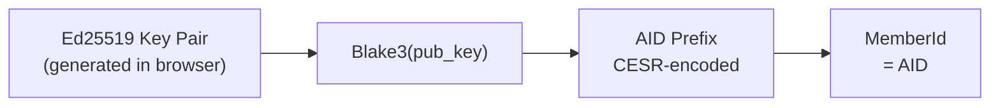
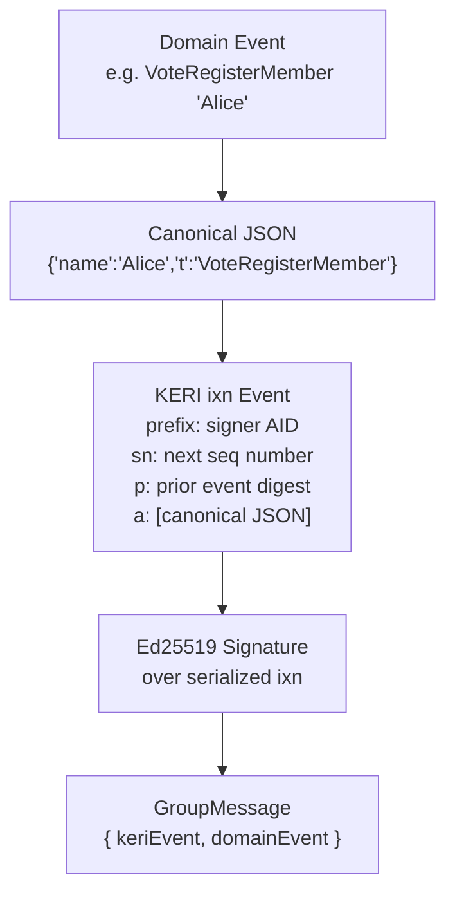
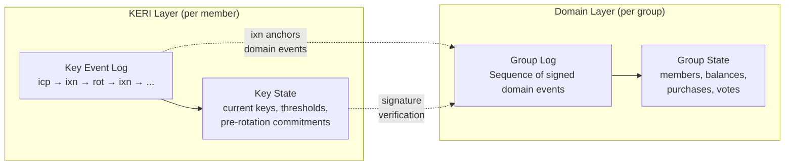
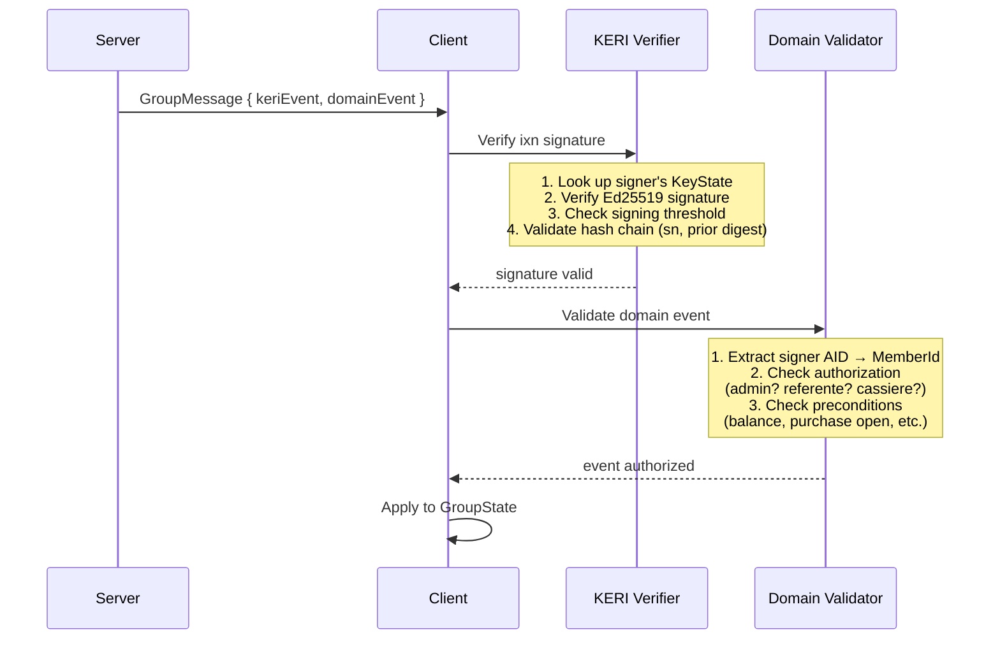
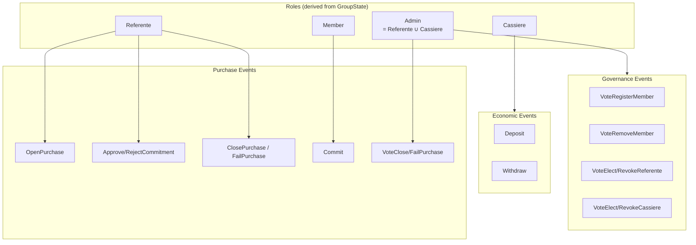
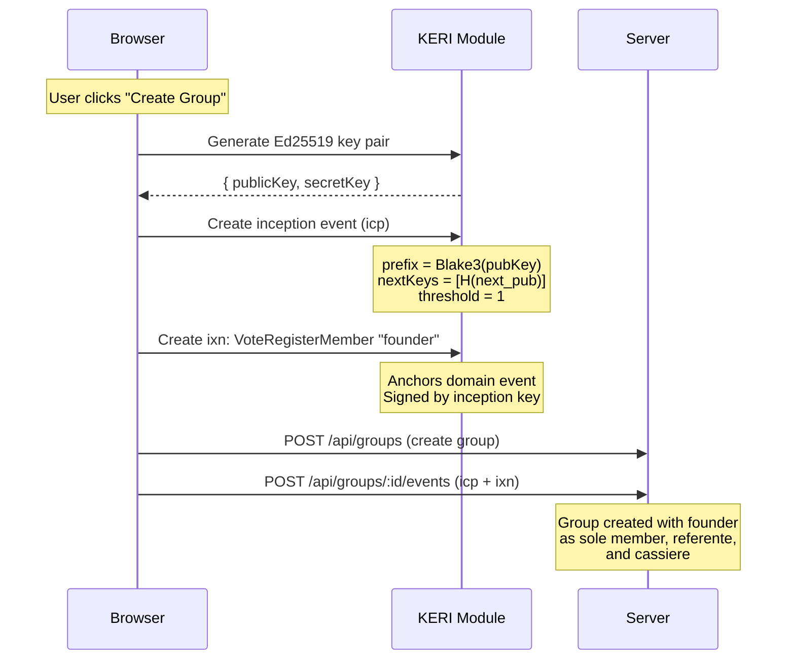
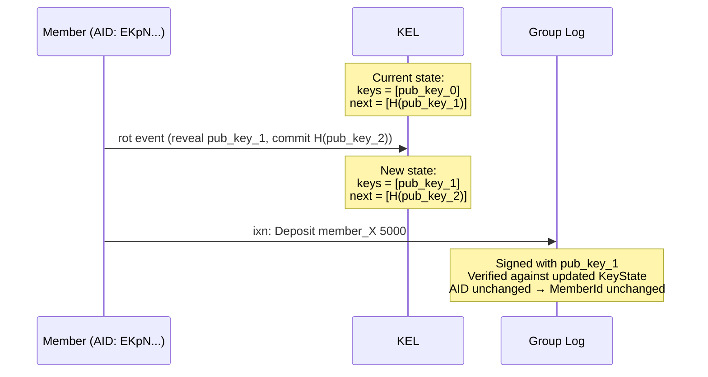
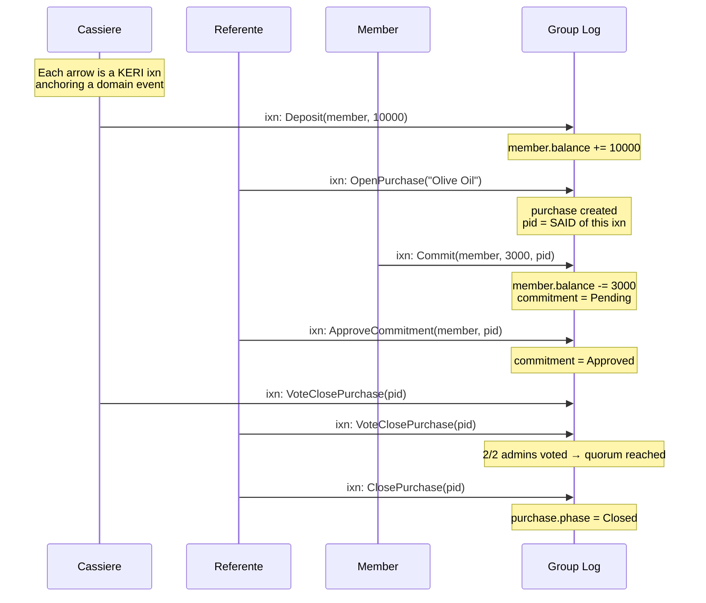
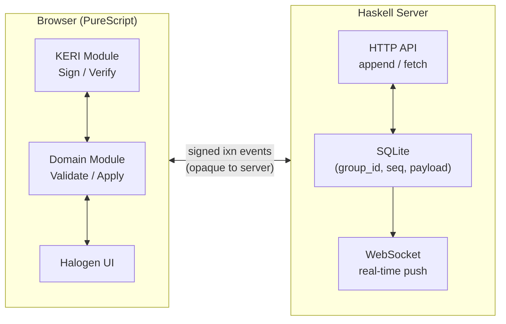

# KERI Integration

How keri-coop maps its cooperative purchasing domain onto KERI primitives.

---

## Identity = KERI AID

Every member is identified by their **Autonomic Identifier** (AID), derived
from their Ed25519 public key via Blake3 hashing and CESR encoding. There is
no username/password — the AID *is* the identity.



The `MemberId` type is a newtype over `AID`:

```purescript
newtype AID = AID String        -- CESR-encoded prefix
newtype MemberId = MemberId AID -- domain alias
```

---

## Domain events as KERI interaction anchors

Every domain action (vote, deposit, purchase, etc.) is wrapped in a KERI
**interaction event** (`ixn`). The domain event is canonically serialized to
JSON and placed in the `anchors` field of the `ixn`. The `ixn` is then
signed with the member's current private key and appended to the group log.



This is implemented in `Protocol.Message.mkGroupMessage`:

1. Serialize the `DomainEvent` to canonical JSON (deterministic field order)
2. Create a KERI `ixn` with the JSON as an anchor
3. Compute the SAID (self-addressing identifier) of the `ixn`
4. Sign the serialized `ixn` with the member's Ed25519 secret key
5. Package as a `GroupMessage` for transport

---

## Two event logs, two purposes

keri-coop maintains two conceptual logs that serve different purposes:



| Log | Scope | Purpose | Events |
|-----|-------|---------|--------|
| **KEL** | Per member | Key management, identity | `icp`, `rot`, `ixn` |
| **Group Log** | Per group | Domain state | Signed domain events anchored in `ixn`s |

The KEL tracks *who controls which keys*. The group log tracks *what happened
in the cooperative*. They are linked: every group log entry is a KERI `ixn`
whose signature is verified against the signer's current key state.

---

## Verification flow

When a `GroupMessage` arrives (via HTTP or WebSocket), the client verifies it
in two layers before applying it to the domain state:



---

## Role authorization matrix

Domain events require specific KERI-authenticated roles. The signer's AID
determines their `MemberId`, which is checked against the current `GroupState`:



| Required role | Domain events |
|---------------|---------------|
| **Admin** | `VoteRegisterMember`, `VoteRemoveMember`, `VoteElect*`, `VoteRevoke*`, `VoteClosePurchase`, `VoteFailPurchase` |
| **Cassiere** | `Deposit`, `Withdraw` |
| **Referente** | `OpenPurchase`, `Approve/RejectCommitment`, `AdjustCommitment`, `ClosePurchase`, `FailPurchase` |
| **Member** | `Commit` (self only, requires sufficient balance) |

---

## Bootstrap: from KERI inception to first admin

A new group starts with a single member who creates a KERI identity
(inception) and then becomes both referente and cassiere:



Since the founder is the only admin at bootstrap, their single vote
immediately reaches quorum (`>= (1+1)/2 = 1`) for all governance actions.

---

## Key rotation and domain continuity

When a member rotates their KERI keys, their AID (and thus `MemberId`) stays
the same — only the controlling keys change. The domain state is unaffected:



This means a member can rotate keys (e.g. after a suspected compromise)
without losing their role, balance, or purchase history.

---

## Event flow: complete purchase lifecycle

A full purchase cycle showing both KERI and domain layers:



Every step is a KERI `ixn` event: cryptographically signed, hash-chained,
and independently verifiable by any client.

---

## Transport: server as dumb relay

The Haskell server never interprets domain events. It stores and forwards
signed KERI events:



The server enforces only:

- **Sequence ordering** — 409 Conflict on duplicate `seq`
- **Append-only** — no updates or deletes

All cryptographic verification and domain validation happen client-side.
A compromised server cannot forge events — it can only withhold them.
