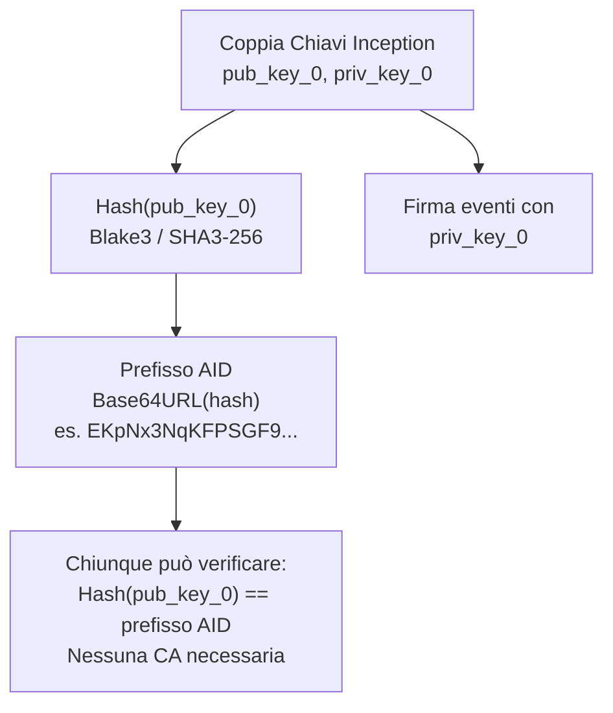
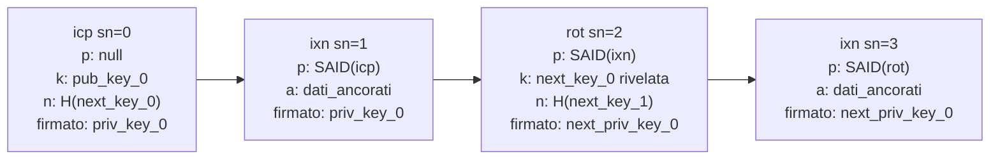
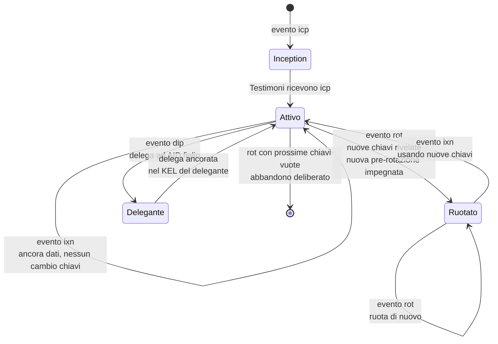
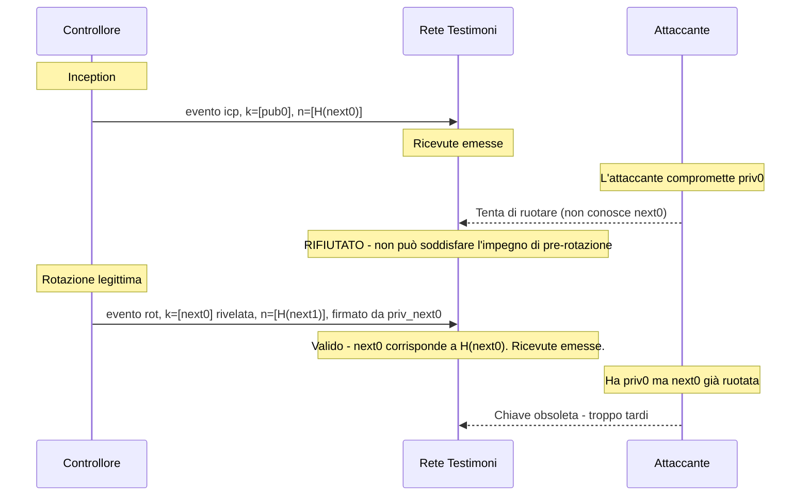
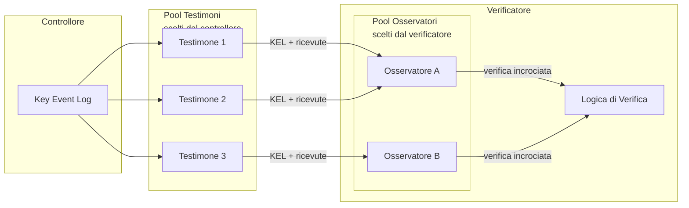
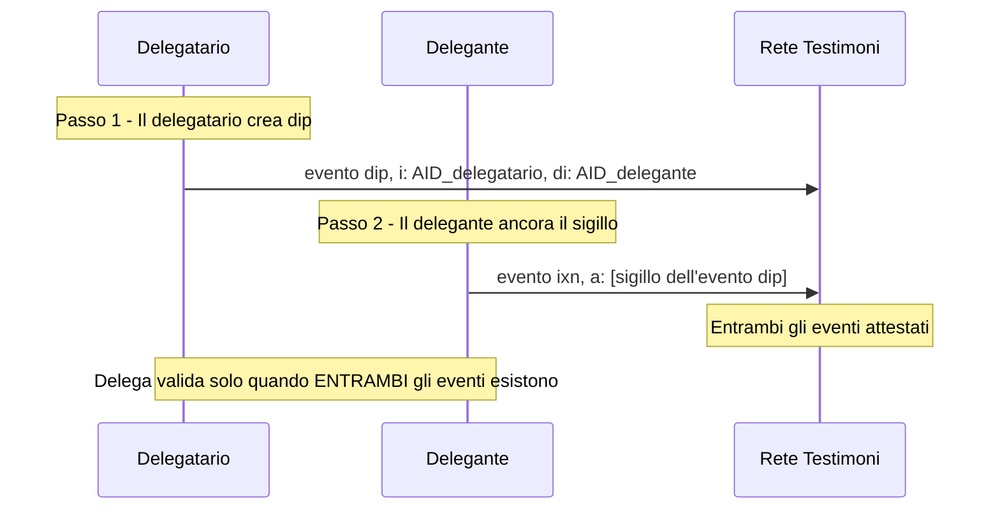
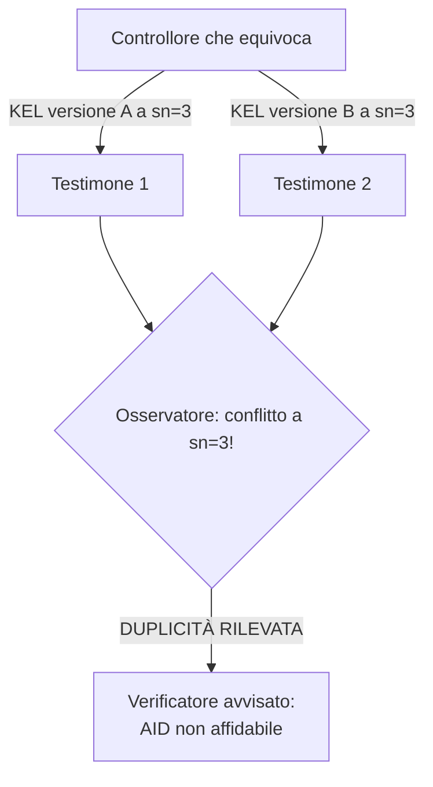
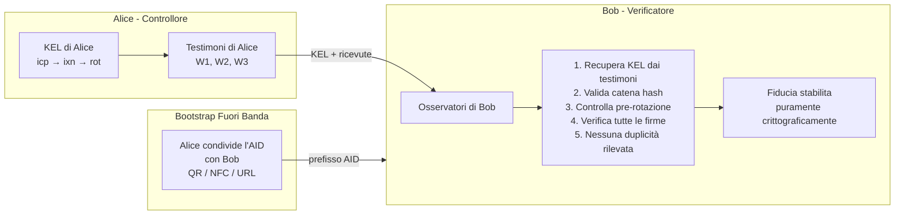
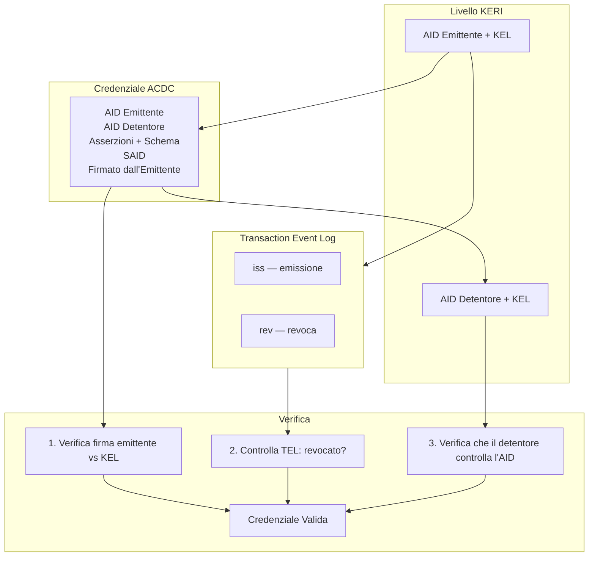

# Protocollo KERI: Un'Introduzione Approfondita

> **Key Event Receipt Infrastructure** — un protocollo di identità decentralizzato costruito sull'autonomia crittografica, la portabilità e la verificabilità, senza dipendenza da alcun registro o ledger.

---

## Indice

1. [Motivazione e Filosofia di Design](#1-motivazione-e-filosofia-di-design)
2. [Concetti Fondamentali](#2-concetti-fondamentali)
3. [Key Event Log (KEL)](#3-key-event-log-kel)
4. [Tipi di Evento](#4-tipi-di-evento)
5. [Gestione e Rotazione delle Chiavi](#5-gestione-e-rotazione-delle-chiavi)
6. [Testimoni e Osservatori](#6-testimoni-e-osservatori)
7. [Delega](#7-delega)
8. [Rilevamento della Duplicità e Modello di Sicurezza KERI](#8-rilevamento-della-duplicita-e-modello-di-sicurezza-keri)
9. [Gerarchia di Fiducia Senza Ledger](#9-gerarchia-di-fiducia-senza-ledger)
10. [KERI vs Altri Metodi DID](#10-keri-vs-altri-metodi-did)
11. [ACDC: Authentic Chained Data Containers](#11-acdc-authentic-chained-data-containers)
12. [Panorama delle Implementazioni](#12-panorama-delle-implementazioni)
13. [Punti di Forza e Compromessi](#13-punti-di-forza-e-compromessi)
14. [Glossario Rapido](#14-glossario-rapido)

---

## 1. Motivazione e Filosofia di Design

KERI è stato creato da Samuel M. Smith (Ph.D.) e pubblicato per la prima volta in un white paper del 2019. Il problema fondamentale che affronta è: **come può un'entità controllare il proprio identificatore crittografico senza dipendere da alcun registro esterno, blockchain o autorità di certificazione?**

La PKI tradizionale lega l'identità a un certificato firmato da una CA. I metodi DID basati su blockchain (did:ethr, did:ion, ecc.) legano l'identità a un ledger specifico. Entrambi gli approcci introducono una **dipendenza infrastrutturale** — l'identità è portabile e disponibile solo quanto l'infrastruttura sottostante lo consente.

I principi di design di KERI sono:

- **Identificatori auto-certificanti (SCI)**: l'identificatore stesso è derivato dalla chiave pubblica, quindi non serve un'autorità esterna per legare chiave e identità.
- **Autonomia crittografica**: il controllore mantiene sempre la capacità di dimostrare il controllo tramite il possesso della chiave privata.
- **Portabilità**: un identificatore KERI e il suo Key Event Log possono essere replicati ovunque; nessun singolo punto di guasto infrastrutturale.
- **Mezzi minimi sufficienti**: evitare la complessità; usare solo ciò che è necessario per raggiungere gli obiettivi di sicurezza.
- **Verificabilità end-to-end**: qualsiasi verificatore può validare indipendentemente l'intera storia di un identificatore riproducendo il Key Event Log.

KERI non è una blockchain, non è un metodo DID (anche se può essere espresso come tale: `did:keri`), e non è un formato di credenziali — è un **livello fondamentale di identità** su cui tutti questi possono essere costruiti.

---

## 2. Concetti Fondamentali

### 2.1 Autonomic Identifier (AID)

Un **Autonomic Identifier (AID)** è un identificatore auto-certificante. È derivato direttamente da una chiave pubblica (o da un impegno verso un insieme di chiavi nel caso multisig):

```
AID = Base64URL( Blake3( chiave_pubblica ) )   # semplificato
```

Più precisamente, l'AID è derivato dal **digest della chiave di inception** — un hash crittografico delle chiavi pubbliche di controllo iniziali. Questo crea un legame permanente e infalsificabile tra l'identificatore e il materiale chiave **all'inception**.

Nessun registro, DNS o blockchain viene consultato per verificare questo legame. La matematica da sola è sufficiente.



### 2.2 Pre-rotazione

L'innovazione più importante di KERI è la **pre-rotazione**: all'inception (e ad ogni rotazione), il controllore si impegna verso il *digest* del *prossimo* insieme di chiavi — prima che quelle chiavi vengano mai usate o rivelate.

```
Evento inception:
  keys:      [chiave_pubblica_corrente_1, ...]
  next_keys: [hash(prossima_chiave_pubblica_1), ...]   <- impegno, non la chiave stessa
```

Questo ha un'implicazione di sicurezza profonda: **anche se un attaccante compromette la vostra chiave privata corrente, non può eseguire una rotazione valida** perché non conosce la prossima chiave pre-impegnata, e non può falsificare una preimmagine valida del digest.

La pre-rotazione eleva il modello di sicurezza di KERI al di sopra della PKI tradizionale e persino della maggior parte dei metodi DID blockchain.

### 2.3 Eventi di Stabilimento vs Non-stabilimento

KERI distingue due classi di eventi:

| Classe | Scopo | Esempi |
|--------|-------|--------|
| **Stabilimento** | Cambia lo stato chiavi | `icp`, `rot`, `dip`, `drt` |
| **Non-stabilimento** | Ancora dati / interazione | `ixn` |

Solo gli eventi di stabilimento cambiano l'insieme di chiavi autoritative. Gli eventi di non-stabilimento (interazioni) permettono al controllore di ancorare dati arbitrari (es. emissioni di credenziali, cambiamenti di endpoint) senza ruotare le chiavi.

---

## 3. Key Event Log (KEL)

Il **Key Event Log (KEL)** è il log autorevole, append-only, concatenato crittograficamente, di tutti gli eventi di gestione chiavi per un AID. È l'unica fonte di verità per lo stato chiavi corrente di un identificatore.

Ogni evento nel KEL:

1. Contiene un **numero di sequenza** (`sn`)
2. Contiene il **digest dell'evento precedente** (`p`) — creando una catena hash
3. È **firmato** dall'insieme di chiavi autoritative corrente
4. Può referenziare un **digest del prossimo insieme di chiavi** (impegno di pre-rotazione)

```
Event_n:
  v:   stringa versione
  t:   tipo evento (icp | rot | ixn | ...)
  d:   SAID (self-addressing identifier = digest di questo evento)
  i:   AID (prefisso identificatore)
  sn:  numero di sequenza
  p:   digest evento precedente
  kt:  soglia di firma
  k:   lista chiavi pubbliche correnti
  nt:  soglia prossime chiavi
  n:   lista digest prossime chiavi (pre-rotazione)
  bt:  soglia testimoni
  b:   lista testimoni
  c:   tratti configurazione
  a:   dati ancorati (per eventi ixn)
```

Il **SAID** (Self-Addressing IDentifier) è il digest dell'evento stesso, calcolato dopo aver sostituito un segnaposto per il campo `d`. Questo dà ad ogni evento un identificatore globalmente unico e auto-certificante.

**Catena hash del KEL — ogni evento si impegna verso il digest dell'evento precedente:**



### Verifica del KEL

Per verificare un KEL, un verificatore:

1. Valida l'evento di inception: controlla che il prefisso AID corrisponda al digest delle chiavi di inception.
2. Per ogni evento successivo: controlla il digest dell'evento precedente, verifica le firme contro lo stato chiavi corrente, verifica il soddisfacimento della soglia.
3. Per ogni rotazione: verifica che le nuove chiavi corrispondano ai digest delle prossime chiavi precedentemente impegnati.

Questa verifica è completamente **end-to-end** e non richiede alcun oracolo esterno.

---

## 4. Tipi di Evento

### `icp` — Inception

Crea l'AID. Stabilisce l'insieme iniziale di chiavi e l'impegno di pre-rotazione verso il prossimo insieme. Il prefisso AID è derivato da questo evento.

### `rot` — Rotazione

Ruota l'insieme di chiavi. Deve soddisfare la soglia di firma dell'insieme *corrente* E rivelare le prossime chiavi pre-impegnate. Stabilisce un nuovo impegno verso le prossime chiavi.

### `ixn` — Interazione

Un evento di non-stabilimento. Firmato dall'insieme di chiavi corrente. Usato per ancorare dati arbitrari (hash credenziali, cambiamenti endpoint, ecc.) nel KEL senza ruotare le chiavi.

### `dip` — Inception Delegata

Come `icp`, ma per un **AID delegato**. L'AID delegante deve ancorare un sigillo di questo evento nel proprio KEL, creando un legame bidirezionale.

### `drt` — Rotazione Delegata

Come `rot`, ma per un AID delegato, che richiede la co-firma del delegante.

**Macchina a stati del ciclo di vita AID:**



---

## 5. Gestione e Rotazione delle Chiavi

### Soglie e Multisig

KERI supporta nativamente il **multisig con soglia pesata**. La soglia di firma (`kt`) può essere:

- Un intero semplice: `"kt": "2"` significa 2-di-n
- Una lista di pesi frazionari: `"kt": ["1/2", "1/2", "1/4"]` — M-di-N più flessibile con pesi

Questo permette cerimonie chiave sofisticate: chiavi HSM, chiavi hardware, chiavi distribuite geograficamente e gerarchie organizzative.

### Recupero da Compromissione Chiave

Con la pre-rotazione, il recupero da una chiave corrente compromessa è diretto:

1. L'attaccante ha la chiave privata *corrente* ma non la *prossima* chiave privata (che non è mai stata esposta).
2. Il controllore usa la prossima chiave (il cui digest era pre-impegnato) per firmare un evento di rotazione.
3. Il KEL viene aggiornato. La chiave dell'attaccante è revocata.
4. Il controllore si impegna verso una nuova prossima chiave.

**Sicurezza pre-rotazione: l'attaccante non può falsificare una rotazione**



Se *sia* la chiave corrente che la prossima vengono compromesse simultaneamente, il recupero richiede il ricorso alla **rete di testimoni** e potenzialmente un processo di recupero sociale — KERI riconosce questo come rischio residuo.

### Rotazione Parziale

KERI supporta la rotazione parziale: non tutte le chiavi in un insieme multisig devono ruotare simultaneamente. Questo permette cerimonie di rotazione progressive senza richiedere che tutti i firmatari siano online contemporaneamente.

---

## 6. Testimoni e Osservatori

### Testimoni

Un **testimone** è un servizio che riceve, valida e rilascia ricevute per gli eventi chiave. I testimoni:

- Mantengono una copia del KEL del controllore
- Emettono **ricevute**: conferme firmate di aver visto e validato un evento
- Forniscono garanzie di disponibilità e consistenza

La **soglia testimoni** (`bt`) specifica quante ricevute dei testimoni sono richieste prima che un evento sia considerato sufficientemente attestato. Questa soglia è stabilita all'inception e può essere aggiornata alla rotazione.

I testimoni **non** controllano l'identificatore — attestano semplicemente di aver visto gli eventi. Il loro ruolo è analogo a notai o servizi di timestamping, ma crittograficamente più forte.

### Osservatori

Gli **osservatori** sono infrastruttura lato verificatore. Monitorano multipli KEL e rilevano duplicità (vedi sotto). A differenza dei testimoni (scelti dal controllore), gli osservatori sono scelti dal **verificatore**.

Questo crea un **modello di fiducia bilaterale**: i controllori scelgono i testimoni, i verificatori scelgono gli osservatori. Nessuna delle due parti può sovvertire unilateralmente il sistema.



---

## 7. Delega

KERI supporta la **delega crittografica**: un AID può delegare l'autorità di gestione chiavi a un altro AID. Questa è la base per costruire gerarchie organizzative e sistemi di gestione chiavi aziendali.

Una relazione di delega richiede:

1. Il **delegatario** crea un evento `dip` (inception delegata).
2. Il **delegante** ancora un sigillo (riferimento hash) del `dip` nel proprio KEL tramite un evento `ixn` o `rot`.
3. Entrambi gli eventi devono esistere ed essere verificabili perché la delega sia valida.

Questo ancoraggio reciproco crea un **legame crittografico bidirezionale**. Non si può falsificare una delega senza compromettere simultaneamente sia le chiavi del delegatario che quelle del delegante.



---

## 8. Rilevamento della Duplicità e Modello di Sicurezza KERI

### Il Problema della Duplicità

Un controllore malevolo (o un attaccante) potrebbe tentare di presentare **due versioni diverse di un KEL** a parti diverse. KERI affronta questo tramite la **rete di osservatori** e l'ordinamento **First Seen**.



### La Duplicità è Rilevabile, Non Prevenibile

KERI non pretende di *prevenire* la duplicità — afferma di rendere la duplicità **rilevabile e attribuibile**. Una volta che un controllore viene colto a equivocare, il suo identificatore è effettivamente avvelenato: nessun verificatore razionale si fiderà di lui.

Questo è analogo al modello di sicurezza di Bitcoin per il double-spend: la rete non impedisce di *provare*, ma rende il tentativo rilevabile ed economicamente irrazionale.

### Assunzioni di Sicurezza KERI

La sicurezza di KERI si riduce a due assunzioni:

1. **Durezza crittografica**: le funzioni hash e le firme digitali sono sicure (assunzione standard).
2. **Soglia di onestà dei testimoni**: un numero sufficiente di testimoni non è in collusione con un avversario. Con un insieme di testimoni ben scelto e diversificato, questa è un'assunzione molto lieve.

Notevolmente, KERI **non** assume tolleranza ai guasti bizantini, incentivi economici (nessun token richiesto), o terze parti fidate.

---

## 9. Gerarchia di Fiducia Senza Ledger

La PKI tradizionale richiede una root CA. I DID blockchain richiedono uno stato canonico del ledger. KERI non richiede nessuno dei due.

Invece, KERI usa un approccio **TERD (Trust Extending Root of Discovery)**: Alice dà a Bob il suo AID fuori banda; Bob risolve il KEL di Alice dai testimoni di Alice; l'osservatore di Bob monitora per duplicità; tutte le verifiche successive sono puramente crittografiche.

La radice di fiducia è **l'evento di inception** e la **cerimonia delle chiavi** che lo ha prodotto.

**Flusso di fiducia end-to-end:**



---

## 10. KERI vs Altri Metodi DID

| Caratteristica | did:key | did:ethr / did:ion | did:keri |
|----------------|---------|-------------------|----------|
| Auto-certificante | Sì | Parziale | Sì |
| Rotazione chiavi | No | Sì (on-chain) | Sì (off-chain) |
| Pre-rotazione | No | No | Sì |
| Dipendenza da ledger | No | Sì (forte) | No |
| Resistenza alla censura | N/A | Dipende dalla chain | Sì |
| Multisig | No | Parziale | Sì (nativo) |
| Delega | No | No | Sì (crittografica) |
| Verificabile offline | Sì | No | Sì |
| Gestione chiavi a lungo termine | No | Parziale | Sì |
| Costo infrastrutturale | Nessuno | Alto (gas) | Basso (testimoni) |

---

## 11. ACDC: Authentic Chained Data Containers

KERI fornisce il **livello di gestione chiavi**. **ACDC** (Authentic Chained Data Containers) è il **livello credenziali** costruito sopra.

Un ACDC è un contenitore dati firmato e auto-descrittivo: emesso da un AID, emesso verso un AID, opzionalmente concatenato a credenziali padre, e revocabile tramite un Transaction Event Log (TEL) ancorato nel KEL dell'emittente.

Gli ACDC possono essere pubblici (completamente divulgati), privati (divulgazione selettiva tramite Graduated Disclosure), mirati (verso un detentore specifico), o non mirati (credenziali al portatore).



La combinazione di KERI + ACDC fornisce un **ecosistema completo di credenziali verificabili** senza alcun registro esterno o economia basata su token.

---

## 12. Panorama delle Implementazioni

### Implementazioni di Riferimento

| Implementazione | Linguaggio | Manutentore |
|-----------------|------------|-------------|
| [keripy](https://github.com/WebOfTrust/keripy) | Python | WebOfTrust / GLEIF |
| [keriox](https://github.com/WebOfTrust/keriox) | Rust | WebOfTrust |
| [signify-ts](https://github.com/WebOfTrust/signify-ts) | TypeScript | WebOfTrust |
| [cesr-one](https://github.com/WebOfTrust/cesr-one) | Python | WebOfTrust |

### CESR: Composable Event Streaming Representation

Tutti gli eventi KERI sono codificati in **CESR** (Composable Event Streaming Representation), una codifica progettata da Sam Smith che è auto-delimitante, compatibile sia in modalità testo (Base64url) che binaria, e componibile. CESR sostituisce la necessità di DER/ASN.1, CBOR o JSON-LD nel livello core del protocollo.

### GLEIF e vLEI

La **Global Legal Entity Identifier Foundation (GLEIF)** sta implementando KERI come fondamento per l'ecosistema **vLEI (verifiable Legal Entity Identifier)** — un sistema di credenziali d'identità standardizzato a livello globale per le entità giuridiche. Questo è il dispiegamento reale più significativo di KERI ad oggi.

---

## 13. Punti di Forza e Compromessi

### Punti di Forza

- **Nessuna dipendenza da ledger**: portabile, resistente alla censura, zero lock-in infrastrutturale.
- **Pre-rotazione**: il più forte recupero da compromissione chiave di qualsiasi protocollo di identità mainstream.
- **Delega crittografica**: gerarchia chiavi di livello enterprise senza registro centrale.
- **Verificabilità end-to-end**: qualsiasi parte può verificare l'intera storia con solo il KEL e le chiavi pubbliche.
- **Percorso di resistenza quantistica**: può aggiornare funzioni hash e schemi di firma tramite rotazione; algoritmi post-quantistici supportati.
- **Nessuna economia basata su token**: nessun gas, staking o commissioni blockchain.

### Compromessi e Sfide

- **Complessità**: il modello di sicurezza di KERI, specialmente il rilevamento della duplicità e la rete di osservatori, è significativamente più complesso della semplice PKI o did:key.
- **Infrastruttura testimoni**: serve una rete di testimoni per disponibilità e consistenza — più semplice di una blockchain ma comunque infrastruttura da gestire.
- **L'ordinamento first-seen è probabilistico**: KERI non fornisce ordinamento totale globale (per design), il che significa che attacchi sottili di equivocazione sono possibili in contesti avversariali, sebbene rilevabili.
- **Discovery**: non esiste un singolo registro canonico per "cercare un AID" — il discovery è gestito fuori banda o tramite indicizzatori secondari.
- **Maturità dell'ecosistema**: al 2025, gli strumenti KERI stanno maturando ma non sono ancora raffinati come did:web o did:ethr per casi d'uso base.
- **Curva di apprendimento**: il modello mentale (KEL, pre-rotazione, testimoni vs osservatori, codifica CESR) è poco familiare alla maggior parte degli sviluppatori.

---

## 14. Glossario Rapido

| Termine | Definizione |
|---------|------------|
| **AID** | Autonomic Identifier — identificatore auto-certificante derivato dal materiale chiave |
| **SAID** | Self-Addressing IDentifier — identificatore che è il digest dei dati che identifica |
| **KEL** | Key Event Log — log append-only, concatenato tramite hash, di tutti gli eventi chiave per un AID |
| **KERL** | Key Event Receipt Log — il KEL più tutte le ricevute dei testimoni |
| **icp** | Evento inception — crea un AID |
| **rot** | Evento rotazione — ruota l'insieme di chiavi |
| **ixn** | Evento interazione — ancora dati senza cambiare chiavi |
| **dip/drt** | Eventi inception/rotazione delegata |
| **Pre-rotazione** | Impegnarsi verso il digest della prossima chiave prima che sia necessaria |
| **Testimone** | Servizio che rilascia ricevute per eventi chiave; scelto dal controllore |
| **Osservatore** | Servizio che monitora i KEL per duplicità; scelto dal verificatore |
| **CESR** | Composable Event Streaming Representation — formato di codifica KERI |
| **ACDC** | Authentic Chained Data Container — formato credenziali KERI |
| **TEL** | Transaction Event Log — log ancorato per emissione/revoca credenziali |
| **Duplicità** | Presentare versioni conflittuali di un KEL a parti diverse |
| **First Seen** | L'ordine in cui un testimone/osservatore riceve per la prima volta un evento |
| **vLEI** | Verifiable Legal Entity Identifier — sistema credenziali basato su KERI di GLEIF |
| **TERD** | Trust Extending Root of Discovery — modello di bootstrap della fiducia di KERI |

---

## Letture Consigliate

- [White Paper KERI](https://arxiv.org/abs/1907.02143) — Samuel M. Smith, 2019
- [Organizzazione GitHub WebOfTrust](https://github.com/WebOfTrust) — implementazioni di riferimento e specifiche
- [Documentazione KERI](https://keri.one) — hub documentazione della comunità
- [Ecosistema vLEI GLEIF](https://www.gleif.org/en/vlei) — dispiegamento reale
- [Specifica CESR](https://weboftrust.github.io/ietf-cesr/draft-ssmith-cesr.html) — specifica di codifica
- [Specifica ACDC](https://weboftrust.github.io/ietf-acdc/) — specifica livello credenziali
